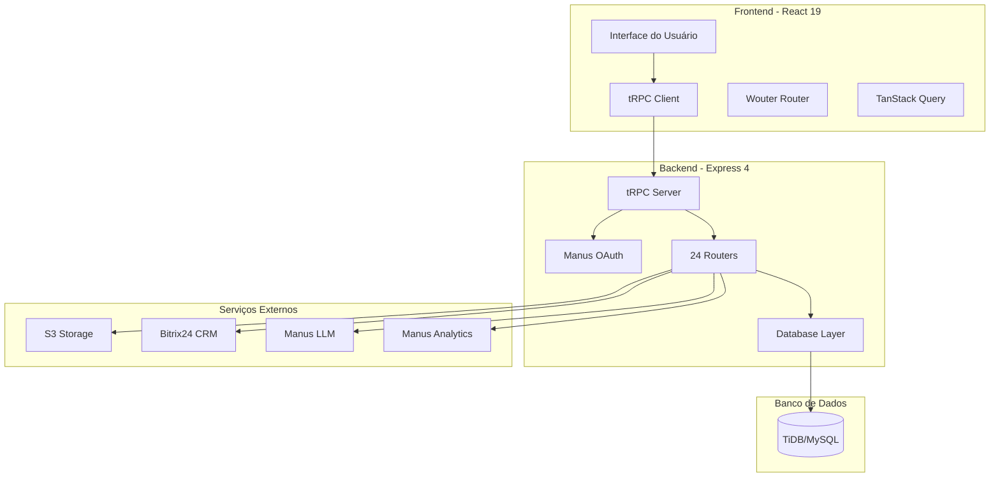
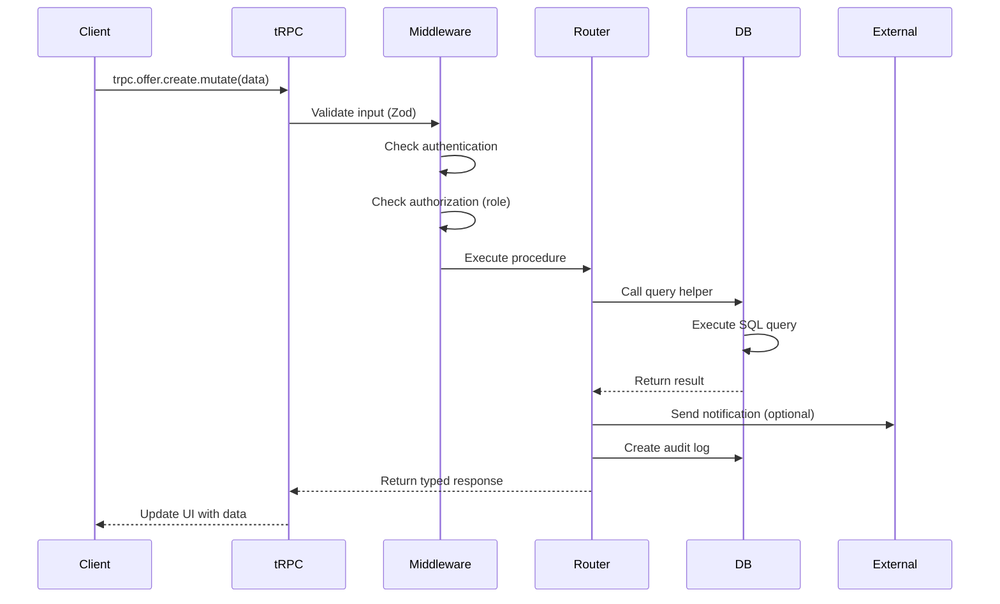
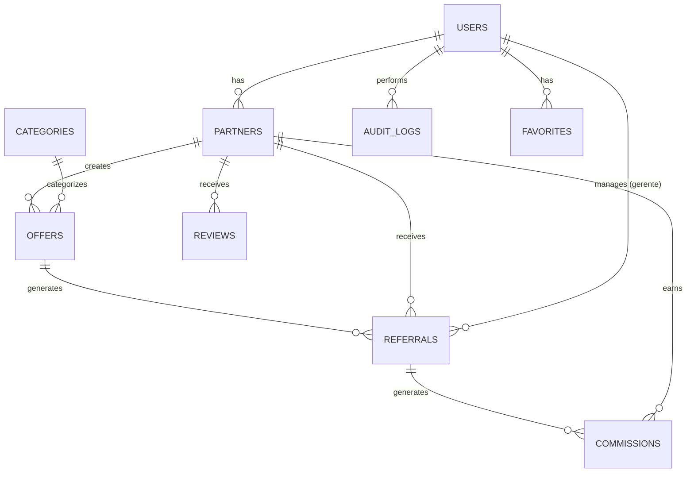
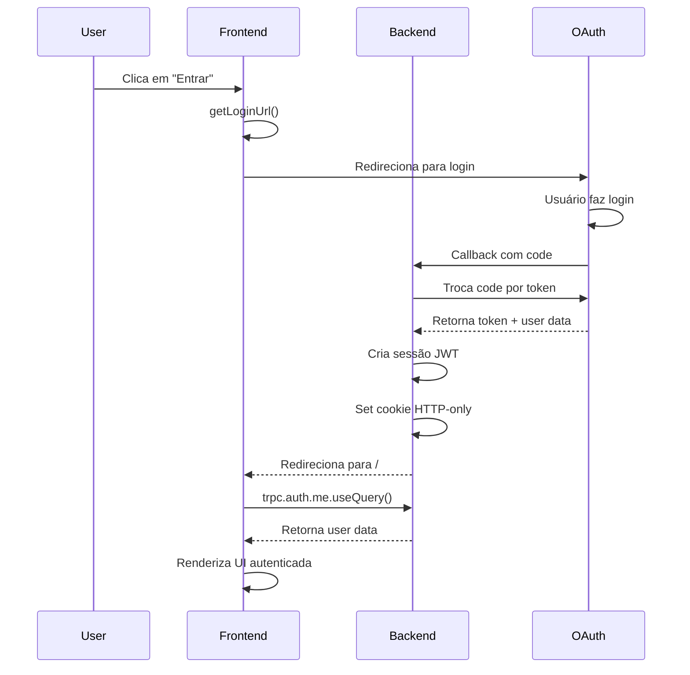
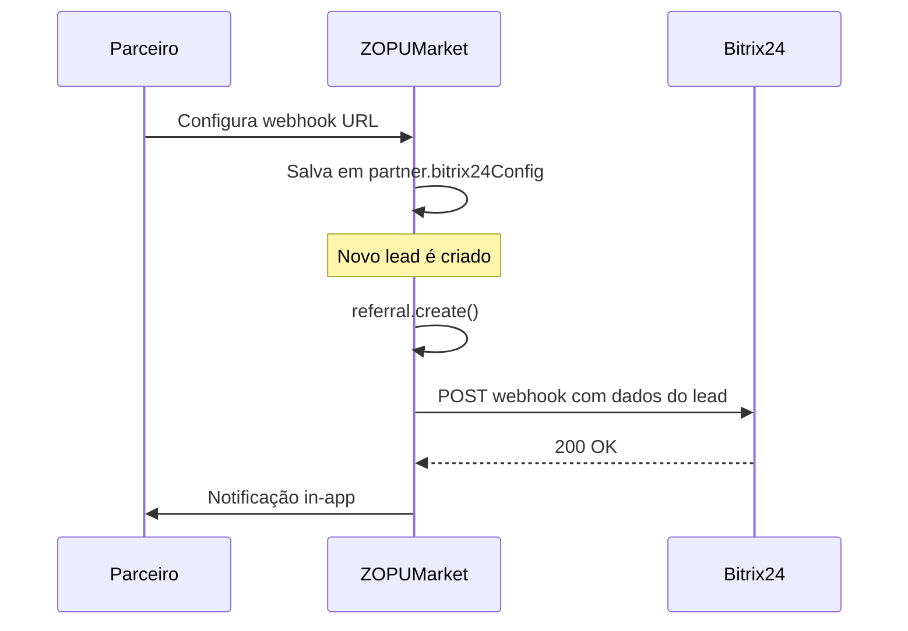
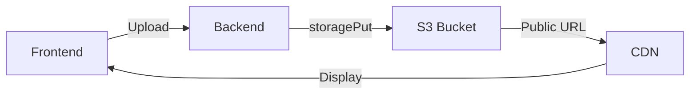
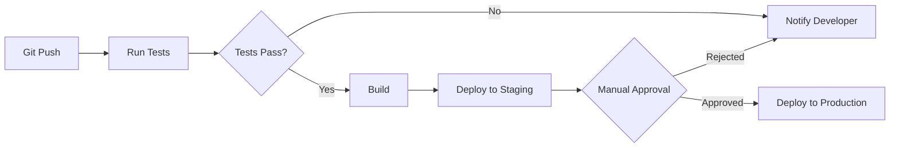

# Arquitetura do Sistema - ZOPUMarket

**Versão:** 1.0  
**Data:** Dezembro 2025  
**Autor:** Manus AI

---

## Visão Geral da Arquitetura

O ZOPUMarket utiliza uma arquitetura moderna de aplicação web full-stack com separação clara entre frontend, backend e camada de dados. A comunicação entre camadas é feita através de tRPC, garantindo type-safety end-to-end e eliminando a necessidade de manutenção manual de contratos de API.

### Diagrama de Arquitetura de Alto Nível



---

## Camadas da Aplicação

### 1. Camada de Apresentação (Frontend)

A camada de apresentação é construída com React 19 e utiliza componentes funcionais com hooks para gerenciamento de estado. O sistema de design é baseado em Tailwind CSS 4 e shadcn/ui, garantindo consistência visual e responsividade.

**Estrutura de Diretórios:**

```
client/src/
├── pages/              # Componentes de página
│   ├── Home.tsx
│   ├── Catalog.tsx
│   ├── admin/          # Páginas administrativas
│   ├── partner/        # Páginas do parceiro
│   └── gerente/        # Páginas do gerente
├── components/         # Componentes reutilizáveis
│   ├── ui/             # shadcn/ui components
│   ├── PublicHeader.tsx
│   ├── AdminLayout.tsx
│   ├── DashboardLayout.tsx
│   └── ResponsiveTable.tsx
├── contexts/           # React contexts
├── hooks/              # Custom hooks
├── lib/
│   └── trpc.ts         # Configuração do tRPC client
├── App.tsx             # Roteamento principal
└── main.tsx            # Entry point
```

**Padrões de Comunicação:**

O frontend se comunica com o backend exclusivamente através do tRPC client. Cada procedure é acessado de forma type-safe através de hooks do TanStack Query:

```typescript
// Query (leitura)
const { data, isLoading, error } = trpc.offer.list.useQuery({ 
  categoryId: 1 
});

// Mutation (escrita)
const createOffer = trpc.offer.create.useMutation({
  onSuccess: () => {
    toast.success("Oferta criada!");
    trpc.useUtils().offer.list.invalidate();
  },
});
```

### 2. Camada de Aplicação (Backend)

A camada de aplicação é implementada com Express 4 e tRPC 11, fornecendo uma API type-safe para o frontend. O backend é responsável por validação de entrada, autorização, orquestração de lógica de negócio e integração com serviços externos.

**Estrutura de Diretórios:**

```
server/
├── _core/              # Infraestrutura do framework
│   ├── trpc.ts         # Configuração do tRPC
│   ├── context.ts      # Context builder
│   ├── cookies.ts      # Gestão de sessão
│   ├── llm.ts          # Helper de LLM
│   ├── map.ts          # Integração Google Maps
│   └── systemRouter.ts # Router do sistema
├── routers.ts          # 24 routers de negócio
├── db.ts               # Query helpers
├── storage.ts          # Integração S3
└── *.test.ts           # Testes vitest
```

**Fluxo de Requisição:**



### 3. Camada de Dados

A camada de dados utiliza Drizzle ORM para interagir com TiDB (MySQL compatível). O schema é definido de forma declarativa e migrações são gerenciadas automaticamente.

**Schema Principal:**

```
drizzle/schema.ts
├── users               # Usuários do sistema
├── partners            # Parceiros cadastrados
├── categories          # Categorias de ofertas
├── offers              # Ofertas de produtos/serviços
├── referrals           # Indicações de leads
├── commissions         # Comissões geradas
├── orders              # Pedidos/transações
├── auditLogs           # Logs de auditoria
├── reviews             # Avaliações de parceiros
├── notifications       # Notificações in-app
├── favorites           # Favoritos de usuários
├── invitations         # Convites para parceiros
├── contracts           # Contratos e elegibilidade
├── clientLeads         # Leads de clientes
└── partnerCases        # Casos de sucesso
```

**Relacionamentos Principais:**



---

## Fluxo de Autenticação

O sistema utiliza Manus OAuth para autenticação, com sessões gerenciadas via cookies HTTP-only.

### Diagrama de Autenticação



### Middleware de Autorização

O sistema implementa quatro níveis de autorização através de middlewares customizados:

```typescript
// Público - sem autenticação
publicProcedure.query(...)

// Protegido - requer autenticação
protectedProcedure.query(({ ctx }) => {
  // ctx.user está disponível
})

// Admin - requer role = "admin"
adminProcedure.mutation(({ ctx }) => {
  // ctx.user.role === "admin" garantido
})

// Gerente - requer role = "gerente_contas" ou "admin"
gerenteProcedure.query(({ ctx }) => {
  // ctx.user.role in ["gerente_contas", "admin"]
})

// Parceiro - requer role = "parceiro"
parceiroProcedure.mutation(({ ctx }) => {
  // ctx.user.role === "parceiro" garantido
})
```

---

## Integrações Externas

### 1. Bitrix24 CRM

Parceiros podem integrar suas contas Bitrix24 para receber leads automaticamente.

**Fluxo de Integração:**



**Procedures Relacionados:**
- `partner.updateBitrixConfig`: Configura integração
- `bitrix.testConnection`: Testa webhook
- `bitrix.getUsers`: Lista usuários do Bitrix24

### 2. S3 Storage

Armazenamento de arquivos (logos, imagens de ofertas, documentos).

**Arquitetura:**



**Helpers Disponíveis:**

```typescript
// Upload de arquivo
const { url } = await storagePut(
  `partners/${partnerId}/logo.png`,
  fileBuffer,
  "image/png"
);

// Obter URL pré-assinada (se necessário)
const { url } = await storageGet(
  `partners/${partnerId}/logo.png`,
  3600 // expira em 1 hora
);
```

### 3. Manus LLM

Integração com modelos de linguagem para funcionalidades de IA.

**Casos de Uso:**
- Geração de descrições de ofertas
- Sugestões de categorização
- Análise de sentimento em reviews
- Chatbot de suporte

**Exemplo de Uso:**

```typescript
import { invokeLLM } from "./server/_core/llm";

const response = await invokeLLM({
  messages: [
    { role: "system", content: "Você é um assistente de marketplace B2B." },
    { role: "user", content: "Sugira categorias para: Consultoria em transformação digital" },
  ],
});

const suggestion = response.choices[0].message.content;
```

### 4. Manus Analytics

Coleta e análise de métricas de uso.

**Eventos Rastreados:**
- `VIEW_OFFER`: Visualização de oferta
- `CLICK_REQUEST`: Clique em "Solicitar Proposta"
- `SUBMIT_PROPOSAL`: Submissão de proposta
- `PARTNER_LOGIN`: Login de parceiro
- `ADMIN_ACTION`: Ações administrativas

**Procedure:**

```typescript
trpc.analytics.track.useMutation({
  onSuccess: () => {
    // Evento registrado
  },
});

// Uso
trackEvent.mutate({
  event: "VIEW_OFFER",
  properties: {
    offerId: 123,
    categoryId: 5,
    partnerId: 42,
  },
});
```

---

## Segurança

### 1. Autenticação e Sessão

O sistema utiliza JWT armazenado em cookies HTTP-only para prevenir ataques XSS. Os cookies têm as seguintes propriedades:

```typescript
{
  httpOnly: true,      // Não acessível via JavaScript
  secure: true,        // Apenas HTTPS
  sameSite: "lax",     // Proteção CSRF
  maxAge: 7 * 24 * 60 * 60 * 1000  // 7 dias
}
```

### 2. Autorização

Todos os procedures sensíveis utilizam middlewares de autorização que verificam o role do usuário antes de executar a ação. Tentativas de acesso não autorizado resultam em erro `FORBIDDEN` e são registradas nos logs de auditoria.

### 3. Validação de Entrada

Todos os inputs são validados com Zod antes de serem processados. Isso previne injection attacks e garante integridade dos dados.

```typescript
.input(z.object({
  email: z.string().email(),
  phone: z.string().regex(/^\+?[1-9]\d{1,14}$/),
  cnpj: z.string().length(14),
}))
```

### 4. Rate Limiting

O sistema implementa rate limiting para prevenir abuso de APIs:

- Endpoints públicos: 100 req/min por IP
- Endpoints autenticados: 300 req/min por usuário
- Endpoints admin: 1000 req/min

### 5. Auditoria

Todas as ações críticas são registradas na tabela `auditLogs` com informações sobre quem executou a ação, quando, e quais valores foram alterados. Logs são imutáveis e mantidos por 5 anos.

---

## Performance e Escalabilidade

### 1. Caching

O frontend utiliza TanStack Query para cache automático de queries. Configurações padrão:

```typescript
{
  staleTime: 5 * 60 * 1000,  // 5 minutos
  cacheTime: 10 * 60 * 1000, // 10 minutos
  refetchOnWindowFocus: false,
}
```

### 2. Optimistic Updates

Operações de lista (favoritos, notificações) utilizam optimistic updates para feedback instantâneo:

```typescript
const addFavorite = trpc.favorite.add.useMutation({
  onMutate: async (newFavorite) => {
    // Cancela queries em andamento
    await utils.favorite.list.cancel();
    
    // Snapshot do estado anterior
    const previousFavorites = utils.favorite.list.getData();
    
    // Atualiza cache otimisticamente
    utils.favorite.list.setData(undefined, (old) => [
      ...old,
      newFavorite,
    ]);
    
    return { previousFavorites };
  },
  onError: (err, newFavorite, context) => {
    // Rollback em caso de erro
    utils.favorite.list.setData(undefined, context.previousFavorites);
  },
});
```

### 3. Paginação

Listas grandes utilizam paginação para reduzir carga:

```typescript
const { data } = trpc.referral.list.useQuery({
  page: 1,
  pageSize: 20,
  status: "PENDING",
});
```

### 4. Índices de Banco

O schema define índices estratégicos para queries frequentes:

```typescript
// Índice composto para busca de ofertas
index("idx_offers_category_status").on(
  offers.categoryId,
  offers.status
),

// Índice para SLA checks
index("idx_referrals_sla").on(
  referrals.status,
  referrals.slaDeadline
),
```

---

## Monitoramento e Observabilidade

### 1. Logs de Aplicação

O backend registra logs estruturados para todas as operações:

```typescript
console.log({
  level: "info",
  message: "Referral created",
  referralId: 123,
  partnerId: 42,
  userId: 1,
  timestamp: new Date().toISOString(),
});
```

### 2. Métricas de Performance

O sistema coleta métricas de performance via Manus Analytics:

- Tempo de resposta de procedures
- Taxa de erro por endpoint
- Uso de memória e CPU
- Queries lentas no banco

### 3. Alertas

Alertas automáticos são configurados para:

- Taxa de erro > 5%
- Tempo de resposta > 2s
- Uso de memória > 80%
- SLAs vencidos
- Comissões pendentes > 30 dias

---

## Deployment e Infraestrutura

### 1. Ambientes

O sistema opera em três ambientes:

**Development:**
- Local na máquina do desenvolvedor
- Hot reload ativado
- Debug logs habilitados

**Staging:**
- Ambiente de homologação
- Dados de teste
- Integração com serviços externos em sandbox

**Production:**
- Ambiente de produção
- Dados reais
- Monitoramento 24/7

### 2. CI/CD Pipeline



### 3. Backup e Disaster Recovery

**Backups:**
- Banco de dados: Backup automático diário
- Arquivos S3: Versionamento habilitado
- Logs: Retenção de 90 dias

**Recovery:**
- RTO (Recovery Time Objective): 4 horas
- RPO (Recovery Point Objective): 24 horas

---

## Conclusão

A arquitetura do ZOPUMarket foi projetada para ser escalável, segura e manutenível. A separação clara entre camadas, o uso de type-safety end-to-end com tRPC e a implementação de boas práticas de segurança garantem que o sistema possa crescer de forma sustentável.

**Princípios Arquiteturais:**

**Separation of Concerns:** Cada camada tem responsabilidades bem definidas e não conhece detalhes de implementação das outras camadas.

**Type-Safety:** TypeScript + tRPC garantem que erros de tipo sejam detectados em tempo de compilação, não em produção.

**Security by Design:** Autenticação, autorização e auditoria são parte fundamental da arquitetura, não adicionadas posteriormente.

**Observability:** Logs, métricas e alertas permitem identificar e resolver problemas rapidamente.

**Scalability:** Arquitetura preparada para crescimento horizontal através de load balancing e database sharding.

Para modificações arquiteturais, consulte a equipe de engenharia e documente todas as decisões neste documento.
